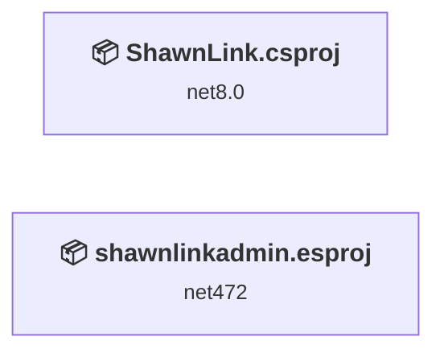
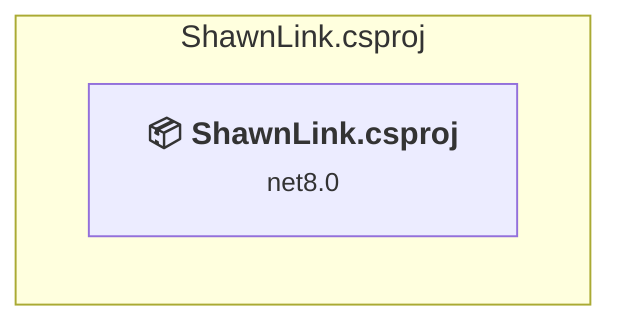
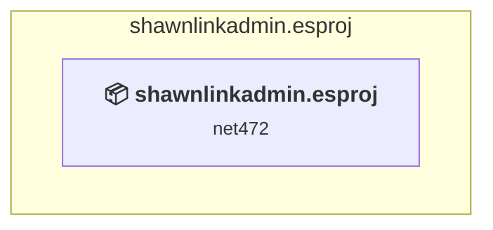

# Projects and dependencies analysis

This document provides a comprehensive overview of the projects and their dependencies in the context of upgrading to .NETCoreApp,Version=v10.0.

## Table of Contents

- [Executive Summary](#executive-Summary)
  - [Highlevel Metrics](#highlevel-metrics)
  - [Projects Compatibility](#projects-compatibility)
  - [Package Compatibility](#package-compatibility)
  - [API Compatibility](#api-compatibility)
- [Aggregate NuGet packages details](#aggregate-nuget-packages-details)
- [Top API Migration Challenges](#top-api-migration-challenges)
  - [Technologies and Features](#technologies-and-features)
  - [Most Frequent API Issues](#most-frequent-api-issues)
- [Projects Relationship Graph](#projects-relationship-graph)
- [Project Details](#project-details)

  - [ShawnLink\ShawnLink.csproj](#shawnlinkshawnlinkcsproj)
  - [shawnlinkadmin\shawnlinkadmin.esproj](#shawnlinkadminshawnlinkadminesproj)

## Executive Summary

### Highlevel Metrics

| Metric | Count | Status |
| :--- | :---: | :--- |
| Total Projects | 2 | All require upgrade |
| Total NuGet Packages | 9 | 7 need upgrade |
| Total Code Files | 28 |  |
| Total Code Files with Incidents | 3 |  |
| Total Lines of Code | 1488 |  |
| Total Number of Issues | 13 |  |
| Estimated LOC to modify | 4+ | at least 0.3% of codebase |

### Projects Compatibility

| Project | Target Framework | Difficulty | Package Issues | API Issues | Est. LOC Impact | Description |
| :--- | :---: | :---: | :---: | :---: | :---: | :--- |
| [ShawnLink\ShawnLink.csproj](#shawnlinkshawnlinkcsproj) | net8.0 | 🟢 Low | 7 | 4 | 4+ | AspNetCore, Sdk Style = True |
| [shawnlinkadmin\shawnlinkadmin.esproj](#shawnlinkadminshawnlinkadminesproj) | net472 | 🟢 Low | 0 | 0 |  | DotNetCoreApp, Sdk Style = True |

### Package Compatibility

| Status | Count | Percentage |
| :--- | :---: | :---: |
| ✅ Compatible | 2 | 22.2% |
| ⚠️ Incompatible | 5 | 55.6% |
| 🔄 Upgrade Recommended | 2 | 22.2% |
| ***Total NuGet Packages*** | ***9*** | ***100%*** |

### API Compatibility

| Category | Count | Impact |
| :--- | :---: | :--- |
| 🔴 Binary Incompatible | 0 | High - Require code changes |
| 🟡 Source Incompatible | 3 | Medium - Needs re-compilation and potential conflicting API error fixing |
| 🔵 Behavioral change | 1 | Low - Behavioral changes that may require testing at runtime |
| ✅ Compatible | 2165 |  |
| ***Total APIs Analyzed*** | ***2169*** |  |

## Aggregate NuGet packages details

| Package | Current Version | Suggested Version | Projects | Description |
| :--- | :---: | :---: | :--- | :--- |
| DotEnv | 0.0.1.1 |  | [ShawnLink.csproj](#shawnlinkshawnlinkcsproj) | ⚠️NuGet package is incompatible |
| dotenv.net | 3.1.3 |  | [ShawnLink.csproj](#shawnlinkshawnlinkcsproj) | ✅Compatible |
| idunno.Authentication.Basic | 2.3.1 |  | [ShawnLink.csproj](#shawnlinkshawnlinkcsproj) | ✅Compatible |
| Microsoft.EntityFrameworkCore.Design | 8.0.1 | 10.0.8 | [ShawnLink.csproj](#shawnlinkshawnlinkcsproj) | NuGet package upgrade is recommended |
| Microsoft.EntityFrameworkCore.SqlServer | 8.0.1 | 10.0.8 | [ShawnLink.csproj](#shawnlinkshawnlinkcsproj) | NuGet package upgrade is recommended |
| Microsoft.Identity.Web | 2.16.1 |  | [ShawnLink.csproj](#shawnlinkshawnlinkcsproj) | ⚠️NuGet package is deprecated |
| Microsoft.Identity.Web.MicrosoftGraph | 2.16.1 |  | [ShawnLink.csproj](#shawnlinkshawnlinkcsproj) | ⚠️NuGet package is deprecated |
| Microsoft.Identity.Web.UI | 2.16.1 |  | [ShawnLink.csproj](#shawnlinkshawnlinkcsproj) | ⚠️NuGet package is deprecated |
| Microsoft.VisualStudio.Azure.Containers.Tools.Targets | 1.19.6 |  | [ShawnLink.csproj](#shawnlinkshawnlinkcsproj) | ⚠️NuGet package is incompatible |

## Top API Migration Challenges

### Technologies and Features

| Technology | Issues | Percentage | Migration Path |
| :--- | :---: | :---: | :--- |

### Most Frequent API Issues

| API | Count | Percentage | Category |
| :--- | :---: | :---: | :--- |
| M:Microsoft.AspNetCore.Builder.ForwardedHeadersExtensions.UseForwardedHeaders(Microsoft.AspNetCore.Builder.IApplicationBuilder) | 1 | 25.0% | Behavioral Change |
| P:Microsoft.AspNetCore.Builder.ForwardedHeadersOptions.KnownNetworks | 1 | 25.0% | Source Incompatible |
| T:Microsoft.AspNetCore.Authentication.OpenIdConnect.OpenIdConnectDefaults | 1 | 25.0% | Source Incompatible |
| F:Microsoft.AspNetCore.Authentication.OpenIdConnect.OpenIdConnectDefaults.AuthenticationScheme | 1 | 25.0% | Source Incompatible |

## Projects Relationship Graph

Legend:
📦 SDK-style project
⚙️ Classic project

## Project Details

### ShawnLink\ShawnLink.csproj

#### Project Info

- **Current Target Framework:** net8.0
- **Proposed Target Framework:** net10.0
- **SDK-style**: True
- **Project Kind:** AspNetCore
- **Dependencies**: 0
- **Dependants**: 0
- **Number of Files**: 41
- **Number of Files with Incidents**: 2
- **Lines of Code**: 1488
- **Estimated LOC to modify**: 4+ (at least 0.3% of the project)

#### Dependency Graph

Legend:
📦 SDK-style project
⚙️ Classic project

### API Compatibility

| Category | Count | Impact |
| :--- | :---: | :--- |
| 🔴 Binary Incompatible | 0 | High - Require code changes |
| 🟡 Source Incompatible | 3 | Medium - Needs re-compilation and potential conflicting API error fixing |
| 🔵 Behavioral change | 1 | Low - Behavioral changes that may require testing at runtime |
| ✅ Compatible | 2165 |  |
| ***Total APIs Analyzed*** | ***2169*** |  |

### shawnlinkadmin\shawnlinkadmin.esproj

#### Project Info

- **Current Target Framework:** net472
- **Proposed Target Framework:** net10.0
- **SDK-style**: True
- **Project Kind:** DotNetCoreApp
- **Dependencies**: 0
- **Dependants**: 0
- **Number of Files**: 0
- **Number of Files with Incidents**: 1
- **Lines of Code**: 0
- **Estimated LOC to modify**: 0+ (at least 0.0% of the project)

#### Dependency Graph

Legend:
📦 SDK-style project
⚙️ Classic project

### API Compatibility

| Category | Count | Impact |
| :--- | :---: | :--- |
| 🔴 Binary Incompatible | 0 | High - Require code changes |
| 🟡 Source Incompatible | 0 | Medium - Needs re-compilation and potential conflicting API error fixing |
| 🔵 Behavioral change | 0 | Low - Behavioral changes that may require testing at runtime |
| ✅ Compatible | 0 |  |
| ***Total APIs Analyzed*** | ***0*** |  |

